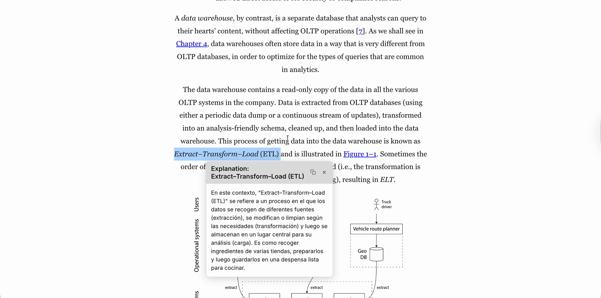

# TextStack

<p align="center">
  
</p>

<p align="center">
  <strong>Deep-reading tool for developers learning AI engineering.</strong><br>
  Tap an unknown term → context-aware explanation inline. Capped weekly SRS queue.<br>
  A modern replacement for Kindle Word Wise and LingQ — built for technical books.
</p>

<p align="center">
  <a href="https://textstack.app">textstack.app</a> ·
  <a href="https://dev.to/mrviduus/i-quit-designing-data-intensive-applications-ddia-three-times-heres-what-i-build-on-the-fourth-5bom">Why I built it</a> ·
  <a href="https://twitter.com/Rexetdeus">@Rexetdeus</a>
</p>

<p align="center">
  <a href="LICENSE"></a>
  
  
  
  
</p>

---

## The problem

I quit *Designing Data-Intensive Applications* three times. Not because it's
hard — I understood most of what was on the page. **The problem was the rest:
unfamiliar terms that broke the flow.** Eventual consistency. Attention
mechanism. B-tree. Writing each one down to look up later works until you
have 40 of them and you've lost the thread anyway.

Summarizing books away defeats the point. The only way to get deep
understanding is to read them — but the friction has to go.

## What TextStack does

**Tap a term → 2–3 sentence LLM-powered explanation tied to the book's
domain.** Not a dictionary definition. If you tap "attention" in an ML
textbook you get the ML meaning, not the everyday one. Powered by OpenAI
`gpt-5-mini` (swap-in friendly — any `ILlmService` impl works).

Terms you don't recognize enter a **capped weekly SRS queue** — no infinite
backlog, no guilt. Common words and the top 15K English words are filtered
out; only technical vocabulary gets surfaced.

| What others do | What TextStack does |
|---|---|
| Dictionary definitions | Context-aware explanations |
| Infinite SRS queue | Capped weekly (no spiral) |
| One-size-fits-all | Domain-aware per book |
| Static Kindle Word Wise (2014) | LLM-powered (2026) |

## Try it

1. [textstack.app](https://textstack.app) — sample chapters open without
   signup.
2. Tap any word you don't recognize.
3. That's the whole pitch.

---

## Features

**Reader**
- Kindle-like experience — themes (light/sepia/dark), fonts, fullscreen,
  keyboard shortcuts
- Text selection — contextual explanation (OpenAI `gpt-5-mini`), dictionary
  fallback (Free Dictionary API), translation (OpenAI), highlights
- TTS — Edge TTS via direct WebSocket (200+ voices, 0.75×–2.0× speed, two-
  layer cache)
- Offline reading — PWA with IndexedDB caching, download manager

**Vocabulary SRS**
- Auto-added while reading — sentence context, definition, translation
- 5 stages (New → Recognition → Recall → Context → Mastered)
- Capped weekly queue + LLM-generated distractors and hints (Ollama
  `qwen3:8b`)
- Review modes: multiple choice, classic flashcard

**Library**
- 1,500+ curated technical and classic books (starter corpus, self-hostable)
- Your own uploads — EPUB / PDF / FB2, auto-parsed with metadata enrichment
- Reading progress sync, bookmarks, highlights, reading stats

**Mobile**
- React Native (Expo), Android on Google Play
- Offline-first, same UX as web

**Admin** ([textstack.dev](https://textstack.dev))
- Book/author/genre CRUD, chapter editor, ingestion queue
- SSG rebuild, auto-publish, SEO backfill

---

## Tech stack

| Layer | Technology |
|-------|-----------|
| Backend | ASP.NET Core (.NET 10), Minimal APIs |
| Database | PostgreSQL 16 + EF Core (snake_case) |
| Search | PostgreSQL FTS |
| Web | React 19, Vite, pnpm |
| Mobile | React Native (Expo 55) |
| LLM | OpenAI `gpt-5-mini` (explanations + translation) + Ollama `qwen3:8b` (distractors, local) |
| TTS | Edge TTS (WebSocket, no API key) |
| SSG | Puppeteer prerender, nginx serves static first |
| Telemetry | OpenTelemetry → Aspire Dashboard |
| Infra | Docker Compose, Cloudflare Tunnel, nginx |

**Architecture**: `API → Application → Domain ← Infrastructure` (modular
monolith). Worker runs ingestion + SRS scoring + SSG jobs.

---

## Quick start

```bash
git clone https://github.com/mrviduus/textstack
cd textstack
cp .env.example .env            # edit with real values
docker compose up --build       # ~3 min cold start
```

| Service | URL |
|---------|-----|
| Web | http://localhost:5173 |
| API | http://localhost:8080 · [Scalar docs](http://localhost:8080/scalar/v1) |
| Admin | http://localhost:81 |
| Aspire (opt-in) | http://localhost:18888 — `docker compose --profile observability up` |

**Prerequisites**: Docker, .NET 10 SDK, Node.js 20+, pnpm.

---

## Development

```bash
# Local dev (no Docker)
dotnet run --project backend/src/Api
pnpm -C apps/web dev           # http://localhost:5173
pnpm -C apps/admin dev         # http://localhost:81

# Mobile
cd apps/mobile && npx expo start

# Tests
dotnet test                     # backend (unit + integration + extraction + search)
pnpm -C apps/web test           # Vitest
pnpm -C apps/web test:e2e       # Playwright

# Lint / format
dotnet format textstack.sln
```

Full command reference: [CLAUDE.md](CLAUDE.md).

---

## Ops / self-hosting

- [Deployment](docs/03-ops/deployment.md) — Cloudflare Tunnel + nginx + Docker
- [Backup & Restore](docs/03-ops/backup.md) — `make backup`, GHA daily dumps
- [Uptime Monitoring](docs/03-ops/uptime-monitoring.md) — UptimeRobot probes
- [Incident Runbook](docs/03-ops/incident-runbook.md) — first-response for
  common outages
- [infra/scripts](infra/scripts/README.md) — long-running pollers

---

## Roadmap (6-month)

- **Now** — Reader + Vocab SRS + offline PWA, 1,500+ books live
- **Next** — Android on Google Play, cap weekly SRS queue UX polish,
  curated AI-engineering corpus (DDIA, ML papers, 15–20 titles)
- **Goal** — one paying customer by October 2026

Progress tracked in [PLAN-presale-8w.md](PLAN-presale-8w.md).

---

## Contributing

Feedback, bug reports, and PRs welcome. See [CONTRIBUTING.md](CONTRIBUTING.md)
(if it exists yet — otherwise open an issue and we'll sort it out).

**Star the repo** if this resonates. That's the only signal I have right now
that I'm building the right thing.

---

## License

[MIT](LICENSE) © 2026 Vasyl Vdovychenko.

- Source code: MIT
- Standard Ebooks corpus (included in seed data): CC0 / public domain
- Edge TTS: used under Microsoft's Edge Read Aloud terms
- Third-party deps: their respective licenses

---

## Why the name

A stack of books. A stack of text. Read through it.
