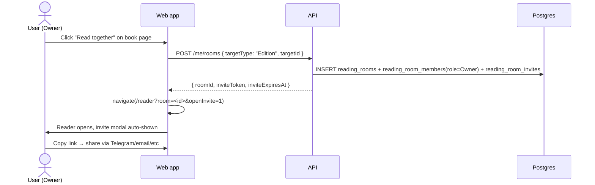
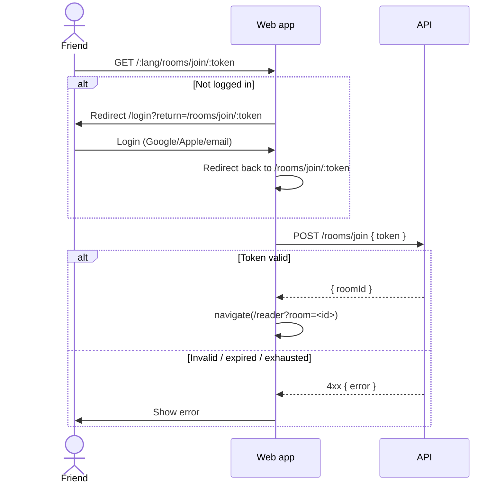
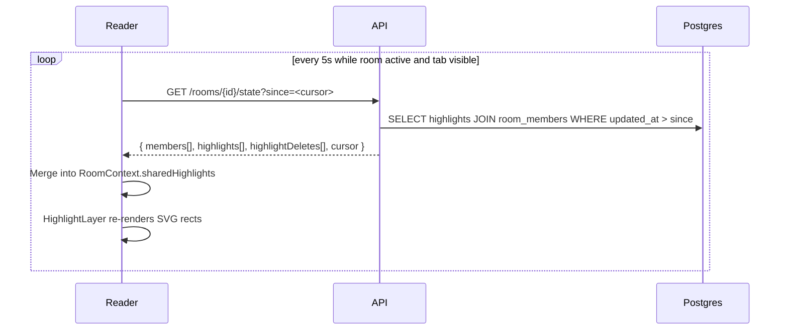
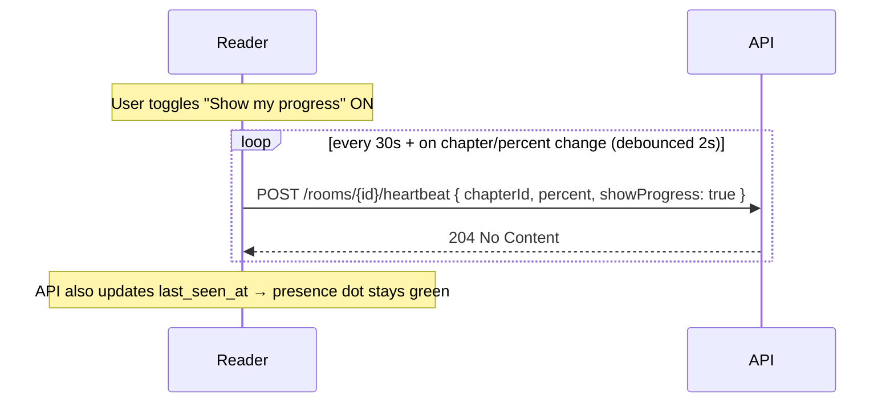
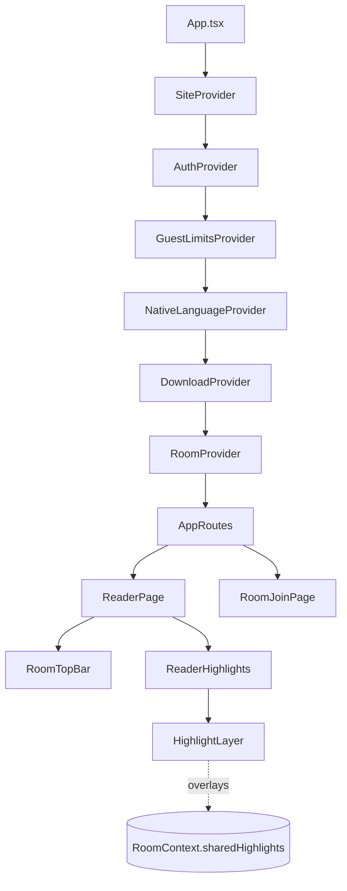
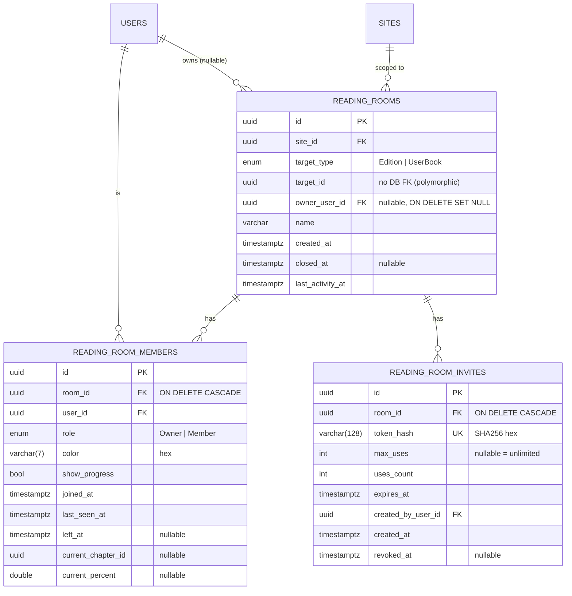

# Reading Rooms (Social Co-Reading)

Read a public book together with friends. See each other's highlights and notes overlaid on the page in real time. Optionally share reading progress.

> **For juniors:** A "Reading Room" is a private group attached to one specific book (Edition). The owner creates the room, sends an invite link, friends join, and from that moment everyone's highlights on that book become visible to other members of the room (color-coded per person). Reading remains the main thing — chat, voice, file sharing are explicitly out of scope.

---

## Overview

| Concept | Plain explanation |
|---------|-------------------|
| **Room** | A group of users who agreed to share their reading on a single book (Edition). |
| **Owner** | The user who created the room. Owner can close the room, generate invites, and revoke them. |
| **Member** | Any user (including owner) who joined. Members see each other's highlights & notes on this book. |
| **Invite** | A short-lived URL token (SHA256 hashed in DB). Single-use or multi-use, with expiry (1h / 24h / 7d / 30d). |
| **Target** | What the room is "about". MVP supports `Edition` (public catalog book) only. `UserBook` is reserved in schema but the API rejects it (legal/DMCA concerns). |
| **Member color** | Deterministic HSL color from `userId` hash — same user is always the same color across all rooms. |
| **Progress** | Opt-in per member (default off). When on, others see your current chapter + percent. |

**What we deliberately do NOT do:**
- No chat / messaging (use Discord/etc).
- No file sharing (only public catalog books).
- No forced-sync reading (we don't pin everyone to the same page).
- No reactions, replies on highlights.
- No email invites (copy-link only).
- No SSG / SEO — rooms are private.

---

## User Cases

### 1. Owner creates a room

A logged-in user opens a book detail page, clicks **"Read together"**, and immediately becomes the owner of a fresh room. The reader opens with the invite modal already showing — copy the link, share it with friends.



**Why `?openInvite=1`?** The flow happens in two steps (POST → navigate), but a member who later visits the same `?room=<id>` URL should NOT see the invite modal pop open. The flag tells the topbar "this is a fresh creation, auto-open the modal once".

> ⚠️ **Subtle bug we hit:** React 18 StrictMode double-invokes effects in dev (mount → unmount → remount). If `inviteOpen` lived as `useState` inside `RoomTopBar`, the remount reset it to `false` *after* the URL flag had already been consumed. Fix: hoist `inviteOpen` into `RoomContext` so it survives child remounts. See `apps/web/src/context/RoomContext.tsx`.

### 2. Invited user joins via link

Friend clicks the invite URL. If not logged in → redirect to login → after login, return to the join page → POST join → redirect to the reader with `?room=<id>`.



**Token storage:** raw token never hits the DB. We hash it with SHA256 (`RoomTokens.HashToken`) and store the hash. When validating, hash the incoming token and look it up. Same pattern used by `PasswordResetToken`.

**Member limit:** 20 per room (hard cap). 21st join → `409 MemberLimitReached`.

### 3. Members read together — shared highlights overlay

Once joined, the reader page polls the room every 5 seconds for new highlights, deletes, and presence updates. New highlights from other members are drawn on top of the page in their member color (`opacity: 0.4`). Click an overlay rect → tooltip shows author name + note text.



**Cursor:** opaque server timestamp. Frontend stores it and sends back next tick — server returns only what changed. Cheap.

**Pause when hidden:** when `document.hidden`, polling pauses; resumes on `visibilitychange`. Saves API quota and battery.

**Anchor resolution:** uses `apps/web/src/lib/textAnchor.ts::findTextByAnchor`. Anchor is a structural pointer (paragraph text snippets + offsets) that survives different fonts, themes, even minor HTML changes. Same function the owner uses for their own highlights — no special path for shared ones.

### 4. Optional: share my reading progress

Default OFF. In the room settings drawer, toggle "Show my progress" → heartbeat starts including `chapterId` + `percent` + `showProgress: true`. Other members see a small bar / chapter name next to your avatar.



**Presence dot:** member is "online" if `last_seen_at < 60s ago`. Computed on the frontend from the polled `members[]`.

### 5. Leave / Close

- **Leave (member)**: `POST /rooms/{id}/leave` → `left_at = now()`. Their highlights are no longer shown to others (the JOIN excludes `left_at IS NOT NULL`). They can rejoin via a fresh invite.
- **Close (owner)**: `DELETE /me/rooms/{id}` → `closed_at = now()`. Room becomes read-only and disappears from everyone's "Reading together" list. No undo in MVP.
- **Owner deletes their account:** room is **NOT** deleted — owner FK is `ON DELETE SET NULL`, `closed_at` left to background cleanup. This protects member data from being nuked by an owner rage-quit. (See migration `20260419174808_SetNullOnOwnerDelete`.)

---

## Architecture

### Component hierarchy



`RoomProvider` is **idle** when no `?room=<id>` query param is present. Only when `setActiveRoom(roomId)` is called does it start polling, fetching state, and exposing data.

### Data model



**Key design choices:**

| Choice | Why |
|--------|-----|
| `target_id` has **no DB FK** | Polymorphic: could point at `editions` or `user_books`. App-level validation enforces `target_type=Edition` for now. |
| `owner_user_id` is **nullable** with `SET NULL` | If owner deletes account, members' shared highlights are preserved. A background worker can later auto-close orphan rooms. |
| **No new highlight schema** | `Highlight.NoteText`, `AnchorJson`, `Color` already exist. Sharing = `JOIN reading_room_members` + filter by `edition_id`. Zero migration on `highlights`. |
| `unique (room_id, user_id) WHERE left_at IS NULL` | Lets a user re-join after leaving without a duplicate-key violation. |
| Member color in DB but **deterministic from userId** | Stored for stability if we ever change the algorithm. Computed on join via `MemberColor.Compute(userId)` → `hsl(hash(userId) % 360, 65%, 55%)`. |

### How shared highlights are queried

There is no new highlights table. We just join through membership:

```sql
SELECT h.*, m.color AS member_color, m.user_id
FROM highlights h
JOIN reading_room_members m ON m.user_id = h.user_id
JOIN reading_rooms r        ON r.id = m.room_id
WHERE r.id = @roomId
  AND r.target_type = 'Edition'
  AND h.edition_id = r.target_id
  AND m.left_at IS NULL
  AND h.updated_at > @since
```

**UserBook branch is intentionally not implemented.** API returns `400 TargetUnsupported` if you try to create a room with `targetType=UserBook`.

### API endpoints

| Method | Path | Auth | Rate limit | Notes |
|--------|------|------|------------|-------|
| `POST` | `/me/rooms` | user | `room-create` 5/5min | `{ targetType, targetId, name? }` → `{ roomId, inviteToken, inviteExpiresAt }` |
| `GET` | `/me/rooms?limit=&active=` | user | — | Library "Reading together" section. |
| `DELETE` | `/me/rooms/{id}` | owner | — | Close room. |
| `POST` | `/rooms/join` | user | `room-join` 20/5min per IP | `{ token }` → `{ roomId }` |
| `GET` | `/rooms/{id}` | member | — | Full room view + members. |
| `POST` | `/rooms/{id}/leave` | member | — | Sets `left_at = now()`. |
| `POST` | `/rooms/{id}/invites` | owner | — | `{ expiresIn?, maxUses? }` → `{ id, token, expiresAt }`. Default expiry 24h. |
| `POST` | `/rooms/{id}/invites/{iid}/revoke` | owner | — | Sets `revoked_at`. |
| `GET` | `/rooms/{id}/state?since=ts` | member | `room-state` 60/min | Cursor-based diff. Polled every 5s. |
| `POST` | `/rooms/{id}/heartbeat` | member | `room-heartbeat` 30/min | `{ chapterId?, percent?, showProgress }` → 204 |

All authorization goes through `RoomService` → `EnsureMember(userId, roomId)`. Non-member → `403`. Closed room → `409 RoomClosed`.

### Polling + heartbeat timing

```mermaid
gantt
    title Per-tab traffic for one active room
    dateFormat  X
    axisFormat  %S s

    section Polling
    GET /state #1   :0, 1
    GET /state #2   :5, 1
    GET /state #3   :10, 1
    GET /state #4   :15, 1

    section Heartbeat
    POST /heartbeat (interval) :0, 1
    POST /heartbeat (chapter changed, debounced) :7, 1
    POST /heartbeat (interval)  :30, 1
```



**Load math:** 10 members × 12 polls/min = 120 RPM/room. 100 active rooms = 12k RPM. Cheap on Postgres + Minimal API. If we hit 500+ active rooms, switch `/rooms/{id}/state` to SignalR.

### Frontend state (`RoomContext`)

```ts
interface RoomContextValue {
  // identity
  roomId: string | null
  room: RoomView | null
  isOwner: boolean
  isConnected: boolean

  // data (refreshed every 5s)
  members: RoomMemberView[]
  sharedHighlights: SharedHighlightView[]

  // UI flags that must survive child remount (StrictMode)
  inviteOpen: boolean
  setInviteOpen: (v: boolean) => void

  // actions
  setActiveRoom: (id: string | null, opts?: { autoOpenInvite?: boolean }) => void
  createInvite: (opts?: { expiresInSeconds?: number; maxUses?: number }) => Promise<...>
  leaveRoom: () => Promise<void>
  closeRoom: () => Promise<void>
  toggleMyProgress: (show: boolean) => Promise<void>
}
```

Provider lives between `DownloadProvider` and `AppRoutes` in `App.tsx`. The reader page calls `setActiveRoom(searchParams.get('room'))` on mount, then renders `<RoomTopBar />` and passes `sharedHighlights` into `<HighlightLayer overlay={...} />`.

### URL state contract

| URL pattern | Behavior |
|-------------|----------|
| `/reader/...?room=<id>` | Activate room, start polling. Member-only access. |
| `/reader/...?room=<id>&openInvite=1` | Same + auto-open invite modal once. Flag stripped on close. Owner-only useful. |
| `/:lang/rooms/join/:token` | Join page. Auth-gated; redirects through `/login?return=...`. |

### Files

#### Backend

```
backend/src/Domain/Entities/
  ReadingRoom.cs           # owner_user_id nullable
  ReadingRoomMember.cs
  ReadingRoomInvite.cs

backend/src/Application/Rooms/
  RoomService.cs           # core business logic
  RoomTokens.cs            # SHA256 hash + raw token gen
  MemberColor.cs           # deterministic HSL from userId
  RoomModels.cs            # DTOs + RoomError enum + Result<T>

backend/src/Api/Endpoints/
  ReadingRoomsEndpoints.cs # all 11 endpoints

backend/src/Infrastructure/
  Persistence/AppDbContext.cs                # DbSets + Fluent API configs
  Migrations/
    *_AddReadingRooms.cs                      # initial schema
    20260419174808_SetNullOnOwnerDelete.cs    # owner FK SetNull fix
```

#### Frontend (web)

```
apps/web/src/api/
  rooms.ts                          # all API functions

apps/web/src/context/
  RoomContext.tsx                   # provider + state + polling/heartbeat loops

apps/web/src/hooks/
  useRoom.ts                        # const { ... } = useRoom()

apps/web/src/components/rooms/
  StartRoomButton.tsx               # on book page
  RoomTopBar.tsx                    # avatars, presence, menu (Invite / Leave / Settings)
  RoomInviteModal.tsx               # generate / copy / revoke link
  RoomSettingsModal.tsx             # toggle progress, leave

apps/web/src/pages/
  RoomJoinPage.tsx                  # /:lang/rooms/join/:token
  ReaderPage.tsx                    # reads ?room=, wires overlay highlights

apps/web/src/components/reader/
  ReaderHighlights.tsx              # accepts shared overlay prop
  HighlightLayer.tsx                # renders SVG rects in member color

apps/web/src/locales/{en,uk}.json   # rooms.* keys
```

#### Tests

```
tests/TextStack.IntegrationTests/RoomsEndpointTests.cs
apps/web/e2e/tests/rooms.spec.ts
```

### Rate-limit zones (`Program.cs`)

| Zone | Limit | Window | Scope |
|------|-------|--------|-------|
| `room-create` | 5 | 5 min | per user |
| `room-join` | 20 | 5 min | per IP |
| `room-state` | 60 | 1 min | per user (5s polling = 12 rpm, lots of headroom) |
| `room-heartbeat` | 30 | 1 min | per user |

---

## How to extend

### Add a new room error

1. Add value to `RoomError` enum in `Application/Rooms/RoomModels.cs`.
2. Map it in `ReadingRoomsEndpoints.MapError` (bottom of file).
3. Throw / return from `RoomService` where appropriate.
4. (Optional) Add i18n key under `rooms.errors.*`.

### Allow rooms on a `UserBook`

Today `RoomService.CreateAsync` rejects `targetType=UserBook` with `RoomError.TargetUnsupported`. To enable:

1. Resolve the legal/DMCA question for shared user-uploaded content.
2. Remove the gate in `RoomService.CreateAsync`.
3. Add a `target_type=UserBook` branch in the highlights JOIN — query `user_highlights` (or whatever the UserBook highlight table is) instead of `highlights`, filtered by `user_book_id = r.target_id`.
4. Add E2E coverage parallel to the Edition flow.

### Add a chat / reactions feature

Out of scope for MVP and intentionally so. If you really need it, design a separate `ReadingRoomMessage` entity, wire SignalR (we picked polling for highlights specifically because they're low-frequency), and consider moderation tooling. Don't try to bolt it onto `/state` — keep concerns separate.

### Replace polling with SignalR

Add a `/hubs/rooms` hub, register in `Program.cs`, push `state` deltas on highlight CUD events. Keep `/state` as a fallback for clients that fail to negotiate WebSocket. Trigger condition: ≥500 active rooms or sustained 50k+ rpm on `room-state` zone.

---

## Verification checklist

When changing room behavior:

1. **Backend** `dotnet test tests/TextStack.IntegrationTests --filter RoomsEndpoint`
2. **Migration** apply on a clean dev DB and confirm snake_case tables / FK behavior with `\d+ reading_rooms` in psql.
3. **Frontend unit** `pnpm -C apps/web test` (covers `RoomContext` reducers if added).
4. **Frontend E2E** `pnpm -C apps/web exec playwright test --project=chromium tests/rooms.spec.ts` — runs the full create → invite → join → highlight-sync flow against a real API container.
5. **Manual two-browser smoke** — User A creates room in browser #1, User B opens invite in browser #2 (separate profile), confirm highlights sync within 5s.
6. **Rate limit smoke** — `for i in $(seq 1 10); do curl -X POST /me/rooms ...; done` should 429 after the 5th in 5 min.
7. **Security** — non-member GET `/rooms/{id}/state` → 403, exhausted invite → 410-equivalent error.

---

## Known limitations

- **Polling vs WebSocket** — 5s lag is acceptable for highlights; if real-time becomes a hard requirement, switch to SignalR.
- **Multi-tab race** — same user with `?room=A` in tab 1 and `?room=B` in tab 2 will race on `current_chapter`. We accept the last-write-wins behavior; not worth a `tab_id` column unless complaints arrive.
- **Anchor fallback** — `findTextByAnchor` is fuzzy; if a chapter is heavily re-ingested between when A highlighted and B viewed, the overlay rect may misplace. Same risk owners already accept for their own highlights.
- **Idle cleanup worker** — orphan rooms (owner deleted, no recent activity) accumulate until we add `ReadingRoomCleanupWorker` (see plan §"Resolved config" → 30-day idle expiry).

---

## Related docs

- [`reader.md`](./reader.md) — how the reader page is structured (where overlay slots in)
- [`offline-reading.md`](./offline-reading.md) — IndexedDB cache (rooms intentionally don't use it; rooms are online-only)
- [`vocabulary-srs.md`](./vocabulary-srs.md) — sibling feature, similar context-provider pattern
