# Мобильный прогон вручную — Android, build 21 из Play Internal Testing

**Дата:** 2026-08-26 · **Сборка:** `app.textstack.mobile` versionCode **21**, установлена из Google Play
по internal-testing ссылке (`installerPackageName=com.android.vending`) · **Бэкенд:** прод `textstack.app`
· **Устройство:** эмулятор Pixel 7 Pro, Android API 37, 1440×3120 @560dpi · **Аккаунт:** свежий,
зарегистрирован в приложении в начале прогона.

Это не автотесты. Это проход руками по приложению с позиции человека, который открыл его впервые,
с оценкой по «Don't Make Me Think». Спека на автоматизацию — [`MOBILE-TEST-PLAN.md`](../MOBILE-TEST-PLAN.md);
этот отчёт отвечает на вопрос, который она не задаёт: **какие из её десяти критериев держатся сегодня,
и что при этом чувствует пользователь.**

---

## Вердикт

Ядро сделано хорошо: чтение приятное, загрузка своей книги — лучший сценарий приложения,
PDF-оригинал работает так, как обещает ADR-012. Но **давать эту сборку 14 тестерам закрытого трека
рано.** Первое, что видит новый пользователь — ложное сообщение, что его версия устарела.
Первое, что он пробует — перевод слова — не работает, потому что приложение никогда не спросило,
какой язык он знает. Прогресс чтения показывается двумя разными числами на одном экране.
Прочитанные страницы PDF теряются целиком. Офлайн библиотека из 12 книг выглядит как пустая.

Пять дефектов уровня P0 — не косметика, а поломки в тех местах, ради которых продукт существует:
доверие к сборке, ядро обучения, прогресс чтения, свои книги, офлайн.

---

## Сводка по сценариям

| ID | Сценарий | Итог |
|---|---|---|
| MQA-01 | Холодный старт, гость | **Fail** — ложный баннер «версия устарела» (P0-1) |
| MQA-02 | Discover, каталог, детали книги | Pass, с замечанием (P3-1) |
| MQA-03 | Гость упирается в стены | **Pass** — гость читает без регистрации, гейты объясняют «зачем» |
| MQA-04 | Регистрация, приземление | **Pass** — ведёт на Library, не на Profile (критерий 5) |
| MQA-05 | Валидация формы входа | Concern — нет проверки формата email (P3-2) |
| MQA-06 | Пустая библиотека | **Pass** — один primary CTA (критерий 8) |
| MQA-07 | Library с 11 книгами | **Pass** — первая книга без скролла, ровно 3 блока (критерии 1, 2) |
| MQA-08 | Таб-бар | **Pass** — нет Home (критерий 3) |
| MQA-09 | View sheet | **Pass** по критерию 7, **Fail** по обратной связи (P2-3) |
| MQA-10 | Мёртвые роуты | **Pass** — ни одного `+not-found` (критерий 10) |
| MQA-11 | Первое чтение, коучмарк | Pass, с замечанием (P2-6: тап не переключает панели) |
| MQA-12 | Прогресс чтения | **Fail** — 10% и 32% на одном экране (P0-3). Позиция при этом восстанавливается |
| MQA-13 | Выделение текста | **Fail** для нового пользователя (P0-2, P1-1, P1-2) |
| MQA-14 | Bookmarks / Highlights | Не смог проверить — не дошёл |
| MQA-15 | Ask this book | Не смог проверить — не дошёл |
| MQA-16 | Загрузка EPUB | **Pass**, сильный сценарий; замечание к рендеру (P2-7) |
| MQA-17 | PDF Original layout | **Fail** — позиция не сохраняется (P0-4). Рендер отличный |
| MQA-18 | Vocabulary | Concern — хром и обрезанный контекст (P2-9, P2-10) |
| MQA-19 | Ask the librarian | Не смог проверить — не дошёл |
| MQA-20 | Офлайн | **Fail** — библиотека выглядит пустой (P0-5, P1-3) |
| MQA-21 | Тёмная тема | **Pass** |

«Не смог проверить» — отдельная категория. Засчитывать её как Pass и есть та болезнь,
которой болеет нынешний Playwright-сьют.

---

## Ревизия десяти критериев A3 из MOBILE-TEST-PLAN

| # | Критерий | Держится? |
|---|---|---|
| 1 | Первая книга видна без скролла при ≥8 книгах | **Да.** Строка «Coriolanus» начинается на ~41% высоты вьюпорта |
| 2 | Ровно три блока над первой книгой | **Да.** Resume-карточка, поиск, ряд фильтров. Полок и каруселей нет |
| 3 | Нет таба Home | **Да.** Library · Discover · (+) · Vocabulary · Profile; у гостя «+» скрыт |
| 4 | `/` редиректит на Library / на Discover гостю | **Да** (проверено косвенно: гость приземляется на Discover, залогиненный на Library) |
| 5 | Вход приземляет на Library, не на Profile | **Да** |
| 6 | Один общий список: аплоад и каталог вместе | **Да.** Загруженные EPUB и PDF стоят рядом с каталожными, вкладок Saved/Uploads нет |
| 7 | Источник / сортировка / вид в View sheet, переключение фильтрует | **Да** структурно, **но** активный фильтр нигде не показан (P2-3) |
| 8 | Ноль книг → FirstBookState с одним primary CTA | **Да** — и именно поэтому P0-5 так больно бьёт |
| 9 | Все роуты из таб-бара рендерятся без ErrorBoundary | **Да** |
| 10 | Нет мёртвых роутов | **Да.** Ни одного `+not-found` за прогон |

**Вывод для Lane A:** девять из десяти критериев держатся. Автотесты нужно писать не на них —
их сломать уже трудно. Писать надо на то, что сломано сейчас: единица измерения прогресса,
сохранение позиции в PDF, офлайн-состояние библиотеки, дефолты языка.

---

## Дефекты

### P0-1 · Свежайшая сборка объявляет себя устаревшей, «Update» ведёт в тупик

Первый экран после установки из Play. Оранжевый баннер: *«Update available — This version no longer
receives updates. Install the latest from Google Play»*. Тап «Update» → Play Store → на странице
приложения только **«Uninstall / Open»**. Обновлять нечего: это и есть последняя сборка.

**Причина.** `LegacyRuntimeBanner` рендерится при `Updates.runtimeVersion === '1.0.0'`
(`apps/mobile/src/lib/legacyRuntime.ts`). Комментарий в компоненте обещает самоотключение
«на сборках после перехода на fingerprint», но `apps/mobile/app.json` до сих пор
`runtimeVersion.policy: "appVersion"` при `version: "1.0.0"` — переход не состоялся
(это же значится в `docs/STATUS.md` как in-flight). Баннер горит на всех сборках, включая свежую.

Баннер закрывается только на сессию — по замыслу. С учётом причины это значит: **при каждом
холодном старте**. Офлайн он тоже показывается и тоже зовёт в Play.

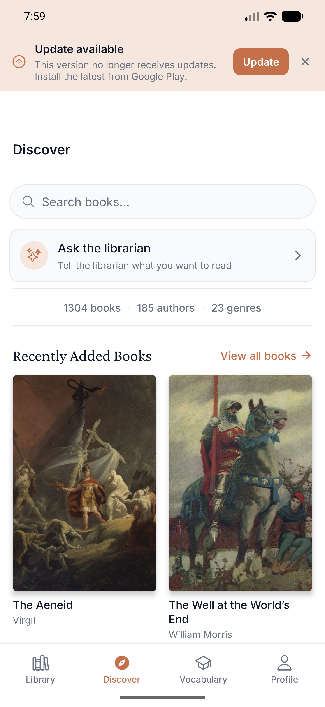
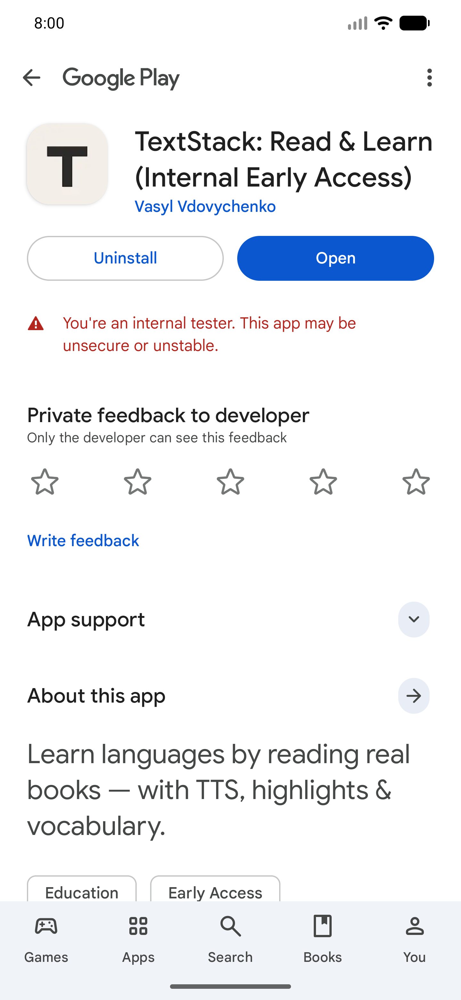

### P0-2 · Приложение никогда не спрашивает, какой язык пользователь знает и какой учит

Profile нового аккаунта: **«I know: English», «Learning: English»**. Оба выставлены молча.
API подтверждает: `nativeLanguage: null` у свежего юзера.

Следствие видно сразу: перевод слова в ридере даёт **ENGLISH → ENGLISH** (P1-1), словарь
наполнялся бы карточками «english → english».

Для продукта, чей тезис — «учи язык, читая настоящие книги», вопрос про родной язык это
первый вопрос, а не настройка, спрятанная в Profile за строкой «I know».

Насколько это решающе, видно из сравнения. **До** настройки языка тулбар выделения —
пять безымянных иконок. **После** (я выставил украинский) — тот же тулбар показывает перевод
прямо в панели, «goddess → богиня», плюс появляются цвет хайлайта и кнопка «+ в словарь».
Между сломанным и отличным продуктом — одна настройка, о которой приложение не спрашивает.

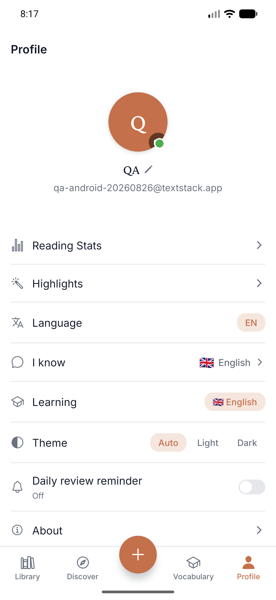
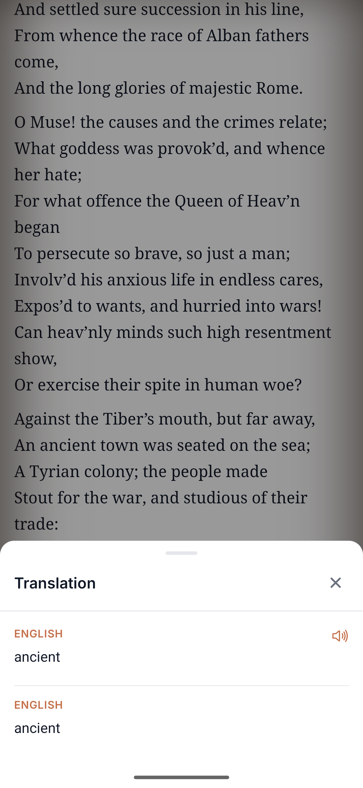
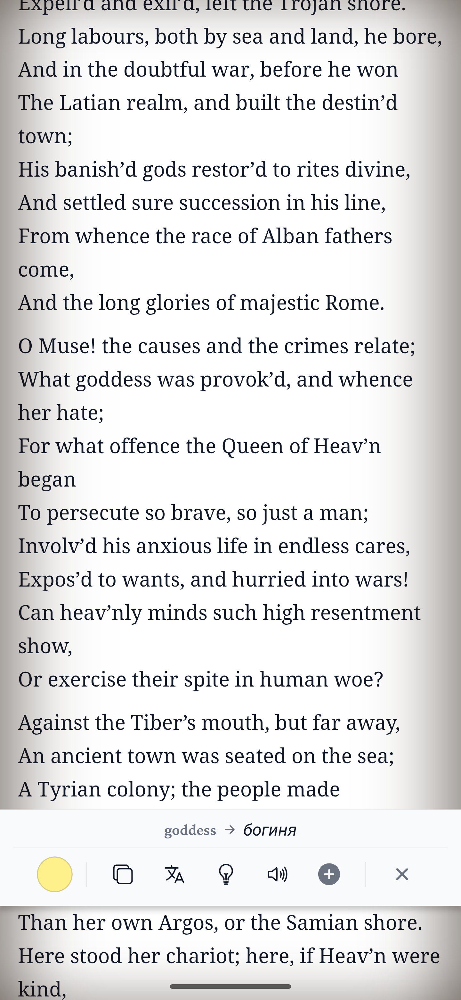

### P0-3 · Одна книга показывает два разных процента на одном экране

Library, без скролла, **после холодного перезапуска** (force-stop → launch):

- Resume-карточка сверху: «The Aeneid — **10% complete**»
- Строка той же книги ниже: «**32%**», полоса залита на треть

**Замер причины.** В тот же момент `GET /me/progress/{editionId}` отдаёт
`chapterSlug: "2-book-ii"`, `percent: 0.31724…`, а нижний бар ридера показывает
«Book II · 2/12 · **10%** · 29 min left». Серверный `percent` — доля прочитанного **внутри
текущей главы** (31.7% Book II). Resume-карточка считает **долю книги** (10%). Строка списка
рисует серверное число как книжный процент. Два разных юнита в одном списке.

Второй замер того же расхождения раньше по сессии: карточка 8% / строка 3%,
сервер `percent: 0.0271`, `chapterSlug: "1-book-i"`. Тогда же в ответе API
`chapterSlug: "1-book-i"` соседствовал с `locator: {"type":"chapter","slug":"2-book-ii"}` —
сохранённая глава и сохранённый локатор указывали на разные главы.

Коммиты #454 «Reading progress: one unit, one reader» и #455 «four inequalities become one answer»
ровно про это. В build 21 единица по-прежнему разная.

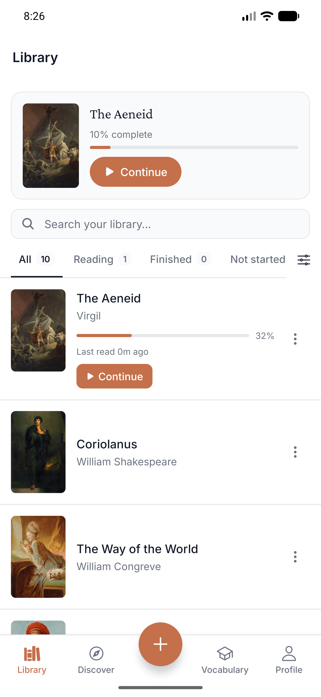

### P0-4 · В PDF позиция чтения не сохраняется: 17 страниц теряются

Загрузил PDF (The Mom Test, 122 стр.) → Start Reading → пролистал до **17 / 122** (нижний чип
подтверждает) → назад.

- Экран книги: «Reading progress **0%**», кнопка «**Start Reading**», не «Continue Reading».
- Повторное открытие: страница **1 / 122**.
- API `GET /me/books/{id}/progress` → `{"locator":"page:1","percent":0.0082}`.

У загруженного EPUB локатор пишется корректно (`scroll:1-the-rustonomicon…:0`), у каталожной
книги позиция восстанавливается. Ломается именно PDF-путь.

Это ровно тот сценарий, под который в MOBILE-TEST-PLAN написан флоу `pdf-open.yaml`
(«assert it resumes on that page and the button reads Continue Reading») — обе проверки падают.

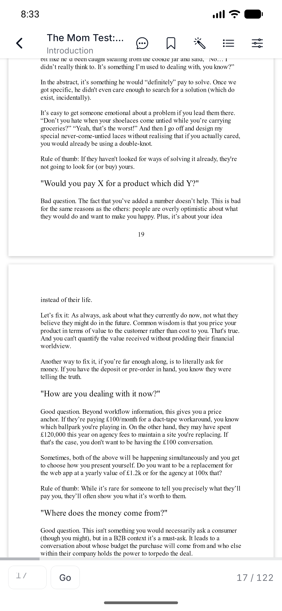
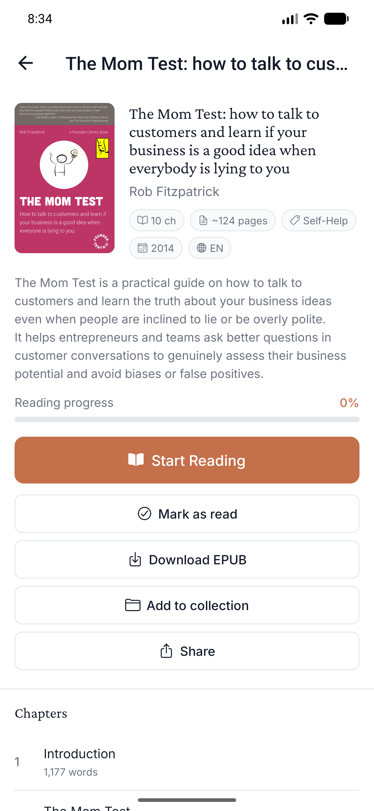

### P0-5 · Офлайн: библиотека из 12 книг показывает экран новичка

Авиарежим → force-stop → запуск → Library. Вместо списка или кэша рисуется `FirstBookState`:
*«Your reader is ready. Add a book you already want to finish»* и кнопка «Upload a book».
Тот самый экран, который видит человек, зарегистрировавшийся минуту назад.

Ни баннера «вы офлайн», ни кнопки «повторить», ни намёка, что данные просто не пришли.
От потери аккаунта неотличимо. Сверху при этом баннер зовёт офлайн-пользователя в Google Play.

После возврата сети библиотека восстанавливается сама (12 книг) — то есть чинить надо
именно отображение состояния, а не загрузку.

**Информация для правильного экрана уже есть в приложении.** `adb logcat` в этот момент:

```
E/ReactNativeJS: 'Library load error:', { [ApiError: Network request failed]
                 status: 0, isNetworkError: true, name: 'ApiError' }
```

`isNetworkError: true` уже проставлен (`safeFetch` в `packages/shared/src/api/client.ts`,
фикс B-33). Экран просто не различает «пустой ответ» и «ответа не было».

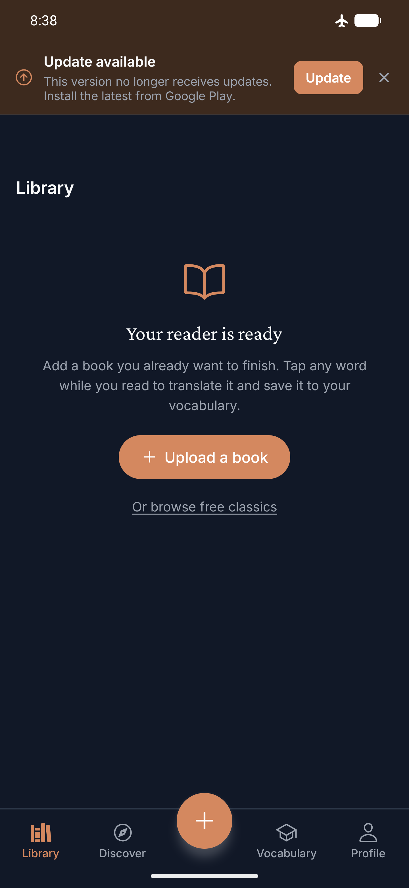

---

### P1

- **P1-1 · Перевод у нового пользователя ENGLISH → ENGLISH.** Панель «Translation» показывает две
  одинаковые секции — «ENGLISH / ancient» и «ENGLISH / ancient». Обе подписаны просто «ENGLISH»:
  где источник, а где цель, не сказано. Следствие P0-2.
- **P1-2 · Выделенное слово не подсвечивается.** Долгий тап открывает тулбар из 4–6 действий,
  но само слово визуально не меняется — ни фона, ни подчёркивания. Над чем сработает
  Translate/Explain/Speak, не видно. Слово при этом захватывается верно (перевод показал именно
  «ancient») — ломается обратная связь, не логика. У пользователя с настроенным языком проблему
  частично закрывает строка «слово → перевод» в тулбаре; у нового пользователя её нет.
- **P1-3 · Офлайн Discover молча пустеет.** Остаются только поиск и карточка «Ask the librarian»,
  каталог, «Recently Added Books» и авторы исчезают без сообщения.

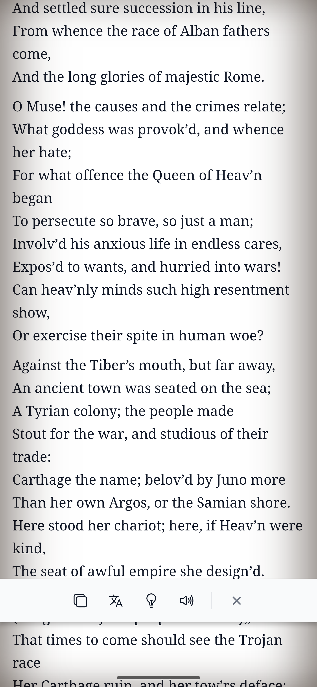

### P2

- **P2-1 · Полоса поперёк текста.** Когда панели ридера спрятаны, верхняя рамка нижнего бара
  продолжает рисоваться поверх текста — тонкая линия у нижнего края, перечёркивающая строку.
- **P2-2 · Тулбар выделения: иконки без подписей.** Copy / 文A / лампочка / динамик. У них есть
  осмысленные `accessibilityLabel` — скринридер знает, видящий пользователь угадывает.
- **P2-3 · Активный фильтр источника нигде не показан.** View → «My uploads» (0) → Done: список
  пуст, счётчики обнулены, «No books match this filter». Что именно отфильтровано — не написано.
  Десять книг просто исчезли. Фильтр переживает уход на другую вкладку, а resume-карточка сверху
  продолжает показывать книгу, которую фильтр исключил — экран противоречит сам себе.
- **P2-4 · Вкладка «Not started» обрезана правым краем**, её счётчик не виден вовсе.
- **P2-5 · Запрос на уведомления без повода.** Аккаунту 5 минут, слов 0, тумблер «Daily review
  reminder» в Off — а посреди листания библиотеки всплывает системный диалог. После отказа
  приложение показывает модалку «Notifications off — Enable notifications in Settings».
  Спросили без контекста, за отказ отчитали.
- **P2-6 · Тап по странице не переключает панели ридера.** Два тапа подряд дали побайтово
  идентичный скриншот. Панели управляются только скроллом. Прочитав вниз пол-главы, чтобы открыть
  оглавление или выйти, надо скроллить обратно вверх по прочитанному. Тап-по-странице —
  конвенция всех читалок; здесь она не работает и нигде не объяснена.
- **P2-7 · Первый экран загруженного EPUB — неоформленная веб-страница.** Оглавление EPUB
  отрисовано дефолтными синими подчёркнутыми ссылками поверх тёплой серифной вёрстки; заголовок
  повторён три раза; нумерация сбита (два пункта «1.»).
- **P2-8 · Переход к странице в PDF сделан по-десктопному.** Узкое поле ввода (обрезано — видно
  «1 /»), кнопка «Go». На телефоне ожидается ползунок.
- **P2-9 · Vocabulary: восемь блоков хрома над одним словом.** Недельный бюджет, чип настроек,
  четыре плитки статистики, безымянная оранжевая полоса, две крупные кнопки, шесть чипов-фильтров,
  поиск, четыре чипа сортировки — и только потом единственное слово. Чип «Mastered» переносится
  на две строки. Это ровно та болезнь, от которой лечили Library.
- **P2-10 · Строка словаря показывает обрывок предложения без самого слова.** Сохранено «goddess»
  с переводом «богиня» и предложением «What goddess was provok'd…». В списке: «goddess /
  …d the crimes relate;…» — не тот кусок, слова в нём нет, перевода нет.

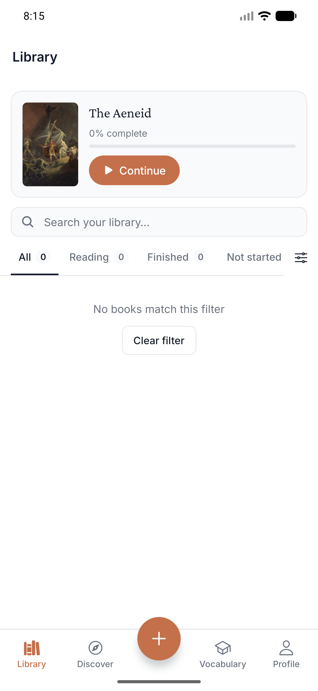

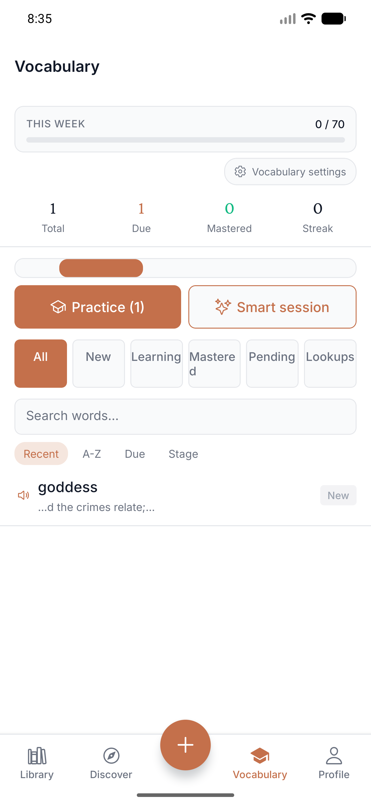

### P3

- **P3-1 · «1304 books · 185 authors · 23 genres» выглядит подписью, но это три ссылки.**
  Тап уводит на экран Books. Рядом «View all books →» оформлено правильно — контраст внутри
  одного экрана.
- **P3-2 · Нет клиентской проверки формата email.** «notanemail» уходит на сервер и возвращает
  «Invalid email or password» — пользователю сообщают, что не подошла пара логин/пароль,
  хотя он не ввёл адрес.
- **P3-3 · «Continue» на книге с 0%** — обещает вернуть туда, где остановился, а возвращать некуда.
- **P3-4 · «I know» и «Learning» оформлены как разные типы настроек** — шеврон против чипа.
- **P3-5 · В меню «Add to library» два из пяти пунктов — заглушки** «COMING IN A FUTURE UPDATE»,
  занимающие столько же места, сколько рабочие.
- **P3-6 · Подзаголовок главы в PDF не следует за страницей** — на стр. 17 всё ещё «Introduction».

---

## Фокус-группа: что понравилось и что раздражает

Оценка по шести принципам Krug'а.

### Понравилось

**Гость читает книгу целиком без регистрации.** Discover → книга → Start Reading, ни одной стены.
Для продукта, где «чтение — это ядро», это правильное и смелое решение. *Реакция первого
пользователя: «о, меня не заставляют регистрироваться, чтобы посмотреть».*

**Типографика ридера.** Серифный шрифт, крупный кегль, щедрый интерлиньяж, тёплый фон.
Читать действительно приятно — а это то, ради чего приложение существует.

**Загрузка своей книги.** Тап «+» → Upload file → чекбокс прав (реально гейтит кнопку) → выбор
файла → книга в библиотеке. Меньше минуты, метаданные (автор, жанр, ~200 страниц, описание)
сгенерированы сразу, без экрана «processing…». Лучший сценарий приложения.
*Реакция: «подождите, оно уже готово?»*

**PDF Original layout.** Настоящие страницы с оригинальной вёрсткой и колонцифрами, плавная
прокрутка, 122 страницы обработались за секунды. Ровно то, что обещает ADR-012.

**Один общий список.** Загруженные EPUB и PDF стоят рядом с каталожными книгами. Никаких
вкладок «Saved / Uploads», по которым надо помнить, куда что положил.

**View sheet.** Источник, сортировка и вид в одном месте, текущий выбор помечен галочкой,
у источников — счётчики. Сканируется за секунду.

**Тёмная тема.** Ровная на всех экранах, ни одного белого пятна.

**Гейты для гостя объясняют «зачем».** Не «Sign In», а «Sign in to save books to your library
and track your reading progress».

**Инлайн-перевод в тулбаре** (когда язык настроен). «goddess → богиня» прямо в панели, без
открытия шита. Быстро и точно попадает в сценарий «не прерывай чтение».

### Раздражает

**«Ваша версия устарела» на свежеустановленной версии.** Первое сообщение приложения о себе —
неправда, и кнопка ведёт в тупик. *Реакция: «я же только что поставил. Что я делаю не так?»*
По Krug'у это худший возможный первый экран: заставляет думать, тревожит, никуда не ведёт.

**Продукт не спрашивает то единственное, без чего он не работает.** Ни при регистрации, ни при
первом открытии ридера, ни при первом переводе никто не спросил, какой язык я знаю. Приложение
молча решило, что английский, и превратило свою главную функцию в перевод английского на
английский. *Реакция: «а зачем оно перевело слово в само себя?»*

**Приложение противоречит само себе про прогресс.** 10% сверху и 32% на той же книге ниже, без
скролла. Прогресс чтения — главный индикатор ценности в приложении про чтение; когда он врёт,
не веришь и остальному. *Реакция: «так сколько я прочитал?»*

**Прочитанное в PDF исчезает.** Семнадцать страниц, «Reading progress 0%», кнопка снова
«Start Reading». *Реакция: «я это уже читал».*

**Офлайн приложение сообщает, что книг нет.** Не «нет сети», не «показываю сохранённое», а
приветственный экран новичка с предложением загрузить первую книгу. *Реакция: «где мои книги?»*

**Тап по странице ничего не делает.** Рефлекс, наработанный на любой читалке, здесь не работает,
и об этом нигде не сказано. Чтобы выйти из главы, надо скроллить назад по прочитанному.

**Тулбар выделения — набор ребусов.** Четыре иконки без подписей, и ни одна не подсказывает,
над каким словом сработает: выделенное слово никак не помечено.

**Vocabulary хоронит контент под интерфейсом.** Одно слово — и восемь блоков управления над ним.
Это та же болезнь, от которой уже вылечили Library.

**Фильтр прячет библиотеку молча.** Переключил источник на «My uploads» — десять книг пропали,
счётчики обнулились, и нигде не написано, что стоит фильтр.

---

## Что чинить первым

1. **P0-1 — погасить баннер устаревшей версии.** До набора 14 тестеров закрытого трека. Либо
   довести переход на `runtimeVersion.policy: "fingerprint"`, либо временно снять условие показа.
   Это первое, что увидит каждый тестер, и оно неправда. Дешевле всех остальных пунктов.
2. **P0-2 — спросить про язык при регистрации.** Один экран из двух вопросов («какой язык знаешь»,
   «какой учишь») превращает неработающее ядро в работающее. Наибольший эффект на единицу работы.
3. **P0-3 — привести прогресс к одной единице.** Строка списка и resume-карточка обязаны считать
   одно и то же. Заодно закрывается известный пункт «Edition progress double-counts» из STATUS.md.
4. **P0-4 — сохранять страницу PDF.** Свои книги — заявленный приоритет продукта, а PDF-путь
   теряет всё прочитанное.
5. **P0-5 — честное офлайн-состояние библиотеки.** Отличать «книг нет» от «не смог загрузить».
   Пустой экран новичка вместо библиотеки читается как потеря данных.

---

## Что осталось непроверенным

Bookmarks и экран Highlights, «Ask this book», «Ask the librarian», Smart session (tutor),
сессия повторения словаря, Reading Stats, deep links, поведение после сворачивания >30 минут,
переключение UK/EN, удаление аккаунта. Помечены как «не смог проверить», не как Pass.

## Состояние тестового аккаунта

Прогон шёл под свежим аккаунтом `qa-android-20260826@textstack.app` (пароль передан отдельно,
в репозиторий не попадает). В проде за ним осталось: 10 книг каталога в библиотеке, две
загруженные книги (EPUB «The Rustonomicon», PDF «The Mom Test»), одно слово в словаре,
прогресс по «The Aeneid», родной язык `uk`. Если аккаунт не нужен — его можно удалить целиком.
