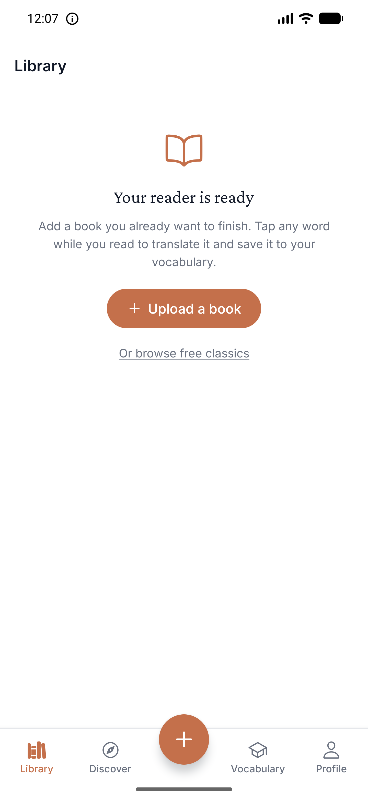
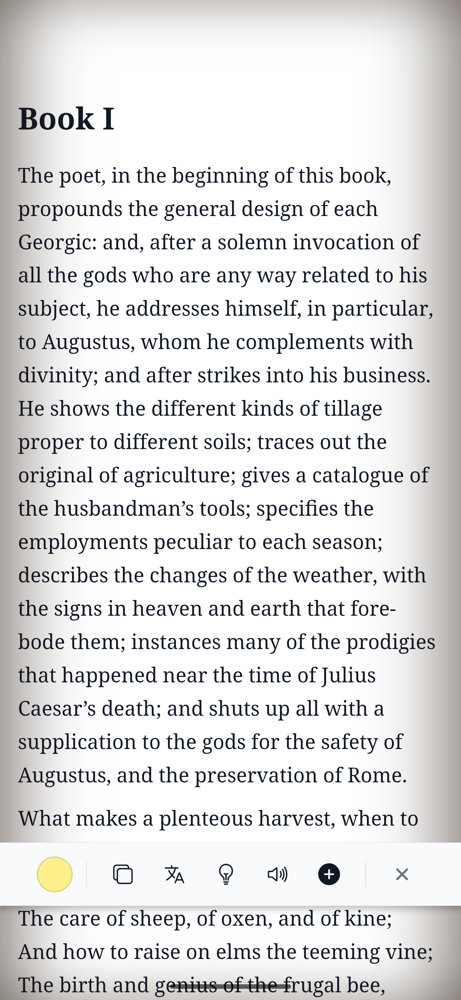
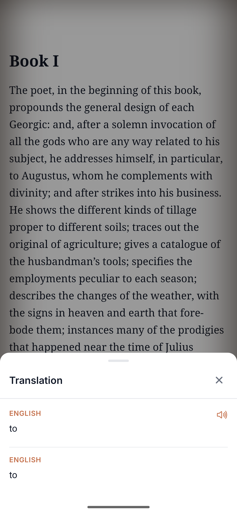
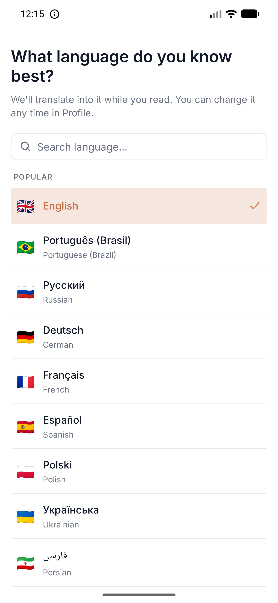
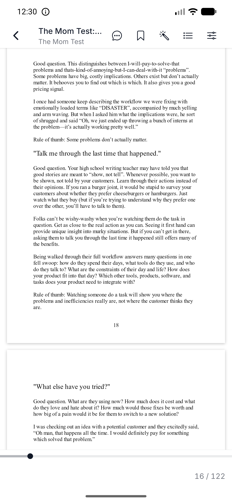
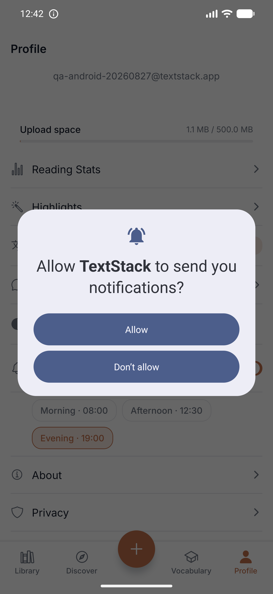
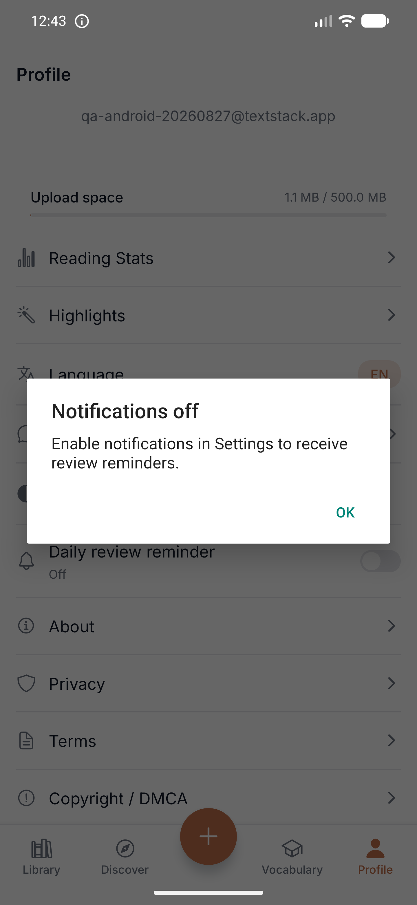
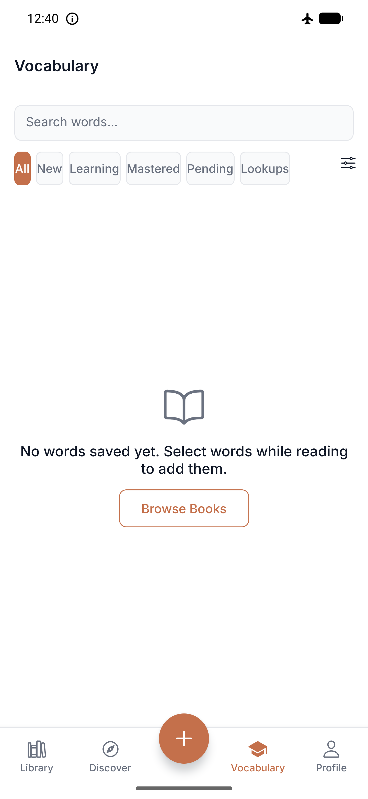
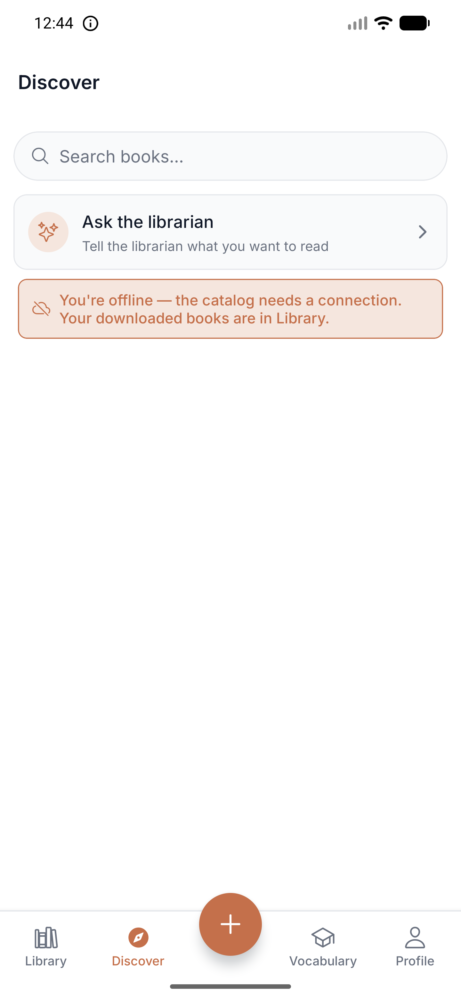
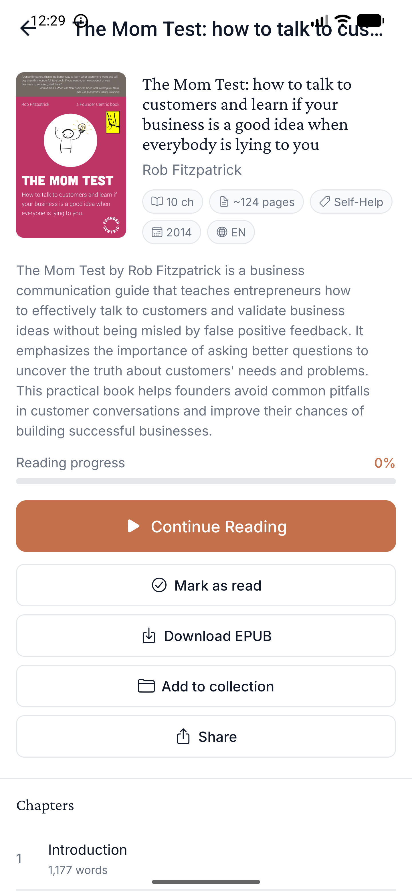

# Повторный прогон — Android, build 22 из Play Internal Testing

**Дата:** 2026-08-27 · **Сборка:** `app.textstack.mobile` versionCode **22**, обновлена из Play
поверх 21 · **Бэкенд:** прод · **Устройство:** эмулятор Pixel 7 Pro, API 37, 1440×3120 ·
**Аккаунт:** новый, `qa-android-20260827@textstack.app`, заведён в этом прогоне ·
**Данные приложения очищены** перед стартом (`pm clear`), чтобы получить состояние нового тестера.

Проверка [вчерашнего отчёта](2026-08-26-android-manual-pass.md) по тому же маршруту.
`docs/STATUS.md` заявляет: 23 из 24 дефектов закрыты, не воспроизведён P2-5.

---

## Итог

**Из 24 дефектов подтверждено закрытыми 20. Два закрыты наполовину, один снимаю как мою ошибку,
один не проверялся. Плюс пять новых, найденных этим же маршрутом.**

Оба P0, которые закрыты не до конца, ломаются одинаково: почина работает на первом круге и
разваливается на втором. Онбординг языка спрашивает — но со второго запуска. PDF запоминает
страницу — но только до второго выхода из ридера.

Отдельно: **P2-5 был моей ошибкой, а не дефектом.** Подробности ниже, разработчик прав.

---

## Что закрыто — проверено на устройстве

| ID | Что было | Проверка |
|---|---|---|
| **P0-1** | Свежая сборка объявляла себя устаревшей | Баннера нет ни при первом запуске, ни офлайн |
| **P0-3** | 10% на карточке и 32% в строке | После холодного перезапуска: **27% и 27%**, сервер `percent: 0.273` — та же единица |
| **P0-5** | Офлайн-библиотека показывала экран новичка | «You're offline. Your library will be here as soon as you reconnect» + «Try again» |
| **P1-1** | Перевод ENGLISH → ENGLISH | С выставленным `uk`: «same → те саме» инлайн в тулбаре |
| **P1-2** | Выделенное слово не подсвечивалось | Слово подсвечено фоном + маркеры выделения |
| **P1-3** | Офлайн Discover молча пустел | Появилось «You're offline — the catalog needs a connection. Your downloaded books are in Library» |
| **P2-1** | Полоса поперёк текста при скрытых панелях | Полосы нет |
| **P2-2** | Иконки тулбара без подписей | Copy · Translate · Explain · Listen · Save |
| **P2-3** | Активный фильтр не показан | У иконки фильтра точка-индикатор, счётчики честные, resume-карточка больше не показывает отфильтрованную книгу |
| **P2-4** | «Not started» обрезана | Помещается вместе со счётчиком |
| **P2-6** | Тап не переключал панели | Тап показывает и прячет; третий скриншот **побайтово равен** первому — страница не сдвигается |
| **P2-7** | Своя книга открывалась на списке синих ссылок | Открывается на тексте книги |
| **P2-8** | Переход к странице PDF по-десктопному | Поле «Go» заменено ползунком |
| **P2-9** | Vocabulary: 8 блоков хрома над одним словом | Три блока: сводка, поиск, фильтры |
| **P2-10** | Строка словаря без слова и перевода | «same / те саме / …with all the **same** rules and semantics…» |
| **P3-5** | Заглушки «COMING IN A FUTURE UPDATE» | В меню только «Upload file» и «Browse all books» |

Ещё четыре мелочи (P3-2, P3-3, P3-4, P3-6) не перепроверялись прицельно — на маршруте
не всплыли.

**Отдельно стоит отметить P2-6.** `STATUS.md` помечал его как «claim only a phone can settle».
Устройство подтверждает: панели переключаются, страница не едет.

---

## Закрыто наполовину

### P0-2 · Вопрос про язык задаётся, но только со второго запуска

Экран «What language do you know best?» существует и работает. Но **на приземлении после
регистрации и после входа он не показывается** — пользователь попадает сразу в Library.

Воспроизведено дважды:

1. **Регистрация** нового аккаунта → Library, вопроса нет.
2. `pm clear` → **вход** тем же аккаунтом (на сервере `nativeLanguage: null`) → Library, вопроса нет.
   Обход по всем четырём вкладкам — вопрос так и не всплыл.
3. Открыл книгу, выделил слово: тулбар **без строки перевода**, Translate даёт
   **ENGLISH → ENGLISH**. То есть исходный симптом P0-2 в этом окне полностью воспроизводится.
4. Перезапуск приложения → вопрос появляется.

**Куда смотреть.** `landAfterAuth` в `app/(auth)/login.tsx` зовёт `shouldAskForLanguage` с
`hasConfirmedLanguage`, которое в этот момент ещё `null` — AsyncStorage не дочитан. Функция
для `null` осознанно возвращает `false` (комментарий в `src/lib/languageOnboarding.ts` прямо
называет это защитой от «flash bug»). Цена этой защиты — что **первое** приземление не спрашивает
никогда. Корневой `LanguageOnboardingGate` в `app/_layout.tsx` должен подхватить, когда storage
дочитается, но за всю сессию не подхватил; кандидат — ранний `return` по
`pathname.includes('login')`, пока модалка входа ещё в стеке (гипотеза, не проверял).






### P0-4 · PDF запоминает страницу, но теряет её на втором выходе

Первый круг работает: дочитал до 17/122 → выход → карточка и строка показывают **14%**,
кнопка стала «**Continue Reading**», сервер `{"locator":"page:17","percent":0.139}` →
открывается на **16/122**. Это то, чего вчера не было вовсе.

Второй круг ломается. После этого возврата сервер отдаёт уже:

```
{"chapterSlug":"2-the-mom-test", "locator":"scroll:2-the-mom-test:0", "percent":0.038}
```

Страничный локатор заменён на главо-скролловый с нулевым смещением, прогресс упал
**14% → 4%**, и следующее открытие книги приземляется на **6/122** вместо 16.
Между этими двумя состояниями я PDF в текстовом режиме не открывал.



---

## Снимаю: P2-5 был моей ошибкой

Вчера я записал «системный запрос на уведомления приходит без повода». `STATUS.md` возражает,
что такого пути в коде нет. **Разработчик прав, я — нет.**

Проверил прямо: Profile → тумблер «Daily review reminder» → системный диалог
«Allow TextStack to send you notifications?» → «Don't allow» → модалка
«Notifications off — Enable notifications in Settings to receive review reminders».
Это в точности та пара экранов, которую я вчера видел.

Вчерашний прогон в этот момент тапал по вычисленным вслепую координатам и, судя по всему,
попал по этому тумблеру. Ни `requestPermissionsAsync`, ни алерт другого вызова не имеют.
Дефект снимается; в счёт не идёт.




---

## Новое, чего вчера не было в списке

### N-1 · Vocabulary офлайн говорит «No words saved yet»

Тот же дефект, что чинили в Library, только на другом экране. Авиарежим → вкладка Vocabulary:
*«No words saved yet. Select words while reading to add them»* и кнопка «Browse Books» —
у пользователя, у которого слово сохранено. Сеть вернули — слово на месте, сервер
`total: 1 ['same']`.

Library и Discover получили честные офлайн-состояния, Vocabulary — нет. Похоже, правку внесли
по экранам, а не в общий шаблон.



### N-2 · Офлайн-баннер Discover не снимается после возврата сети

Выключил авиарежим, `ping` с устройства проходит, Library подтянула 12 книг, Vocabulary — своё
слово. Discover продолжает показывать «You're offline». Уход на другую вкладку и возврат не
помогает; снимается только полным перезапуском приложения. Кнопки «повторить» на баннере нет.



### N-3 · Страница книги показывает 0%, пока хранится страничный локатор

Пока у PDF на сервере лежал `page:17` (14%), карточка и строка в Library показывали 14%,
кнопка — «Continue Reading», **а экран самой книги — «Reading progress 0%»** с пустой полосой.
Проверял дважды с паузой, значение стабильное.

Позже, когда локатор подменился на `scroll:…` (см. P0-4), тот же экран стал показывать 4% —
совпадая с сервером. Похоже, экран книги умеет читать только главо-скролловый прогресс и
отдаёт 0% для страничного.

Ирония в том, что правка называется «a percentage now travels with the unit it is measured in»:
единицу теперь возят вместе с числом, но третий экран этого числа всё ещё не читает.



### N-4 · Шапка экрана книги налезает на статус-бар

На странице загруженной книги заголовок отрисован поверх часов и иконок связи — верхний inset
не учтён. На вкладках (Library, Discover) шапки стоят правильно.

### N-5 · «Last read −1m ago»

Относительное время ушло в минус сразу после записи прогресса — округление против часов
устройства. Через минуту становится «1m ago».

**Мелочь:** на вкладке Vocabulary чип «All» подрезан левым краем экрана.

---

## Счёт

| | |
|---|---|
| Подтверждено закрытыми | **20** |
| Закрыто наполовину | **2** (P0-2, P0-4) |
| Снято как ошибка тестировщика | **1** (P2-5) |
| Не перепроверялось | **1** (P3-6) |
| Новых дефектов | **5** (N-1…N-5) |

## Что чинить первым

1. **P0-2** — заставить вопрос про язык срабатывать на первом приземлении. Пока он ждёт второго
   запуска, каждый новый пользователь проходит ровно через тот сломанный перевод, ради которого
   экран и делали.
2. **P0-4** — не давать главо-скролловому локатору перезаписывать страничный. Сейчас PDF теряет
   позицию на втором выходе, то есть у любого, кто открыл книгу дважды.
3. **N-1** — офлайн-состояние Vocabulary. Тот же шаблон, что уже написан для Library.
4. **N-3** — экран книги должен читать страничный прогресс.
5. **N-2 и N-4** — залипший баннер Discover и шапка поверх статус-бара.

## Состояние тестового аккаунта

`qa-android-20260827@textstack.app`: 10 книг каталога, две загруженные (EPUB и PDF), одно слово
в словаре, `nativeLanguage: uk`. Вчерашний `qa-android-20260826@textstack.app` тоже жив.
